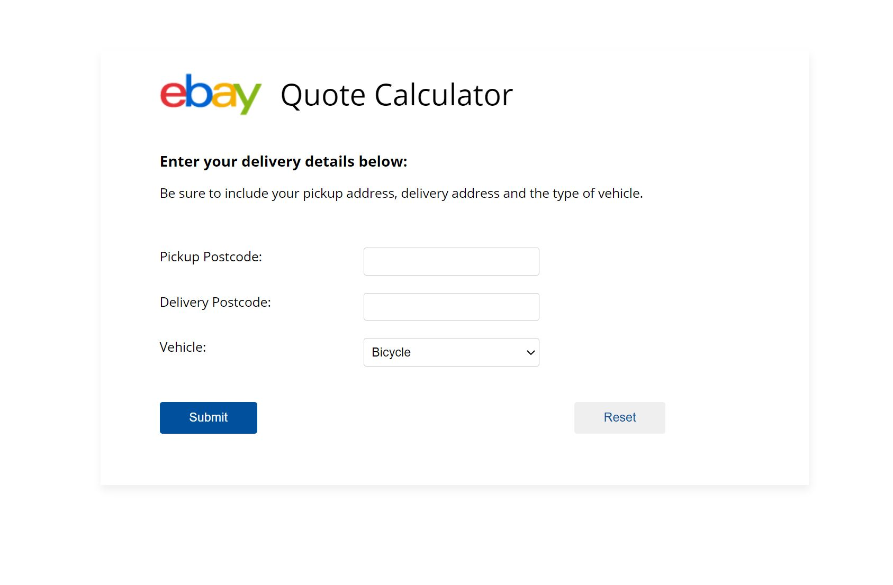

# Ebay Take Home Exercise

Welcome to my take home exercise solution for eBay. The following contains my Spring Boot solution for building a RESTful endpoint for eBay to workout the price for delivery. 
I have refractored and changed around the original code given and created my own project from scratch using the original files. This would ensure that I have installed 
all of the correct dependencies that were available. Kindly see below for the list of dependencies.

## Dependencies
* starter-thymeleaf
* starter-web
* Build with Gradle

## Languages/Frameworks
* Spring Boot Java 
* HTML
* CSS
* AJAX
* JavaScript
* JSON

## Assumptions
* N.B - In this project, I had to deliberately avoid using the standard "camelCasing" convention of naming variables, getters and setters. All were deliberately changed to lowercase (and underscores for multiword variables) in order for the application to work properly. The names "delivery_postcode" and "pickup_postcode" had to be consistent throughout the entire project in order for both Spring Boot and JSON to communicate with each other. Kindly, pardon this accommodation I had to make.

* Therefore, testing for my project MUST be best done manually, in case certain test cases do not work with the naming of the variables, getters and setters. I can promise you everything works perfectly fine.

## Basic Service/Price By Vehicle
Given that various vehicles would have a different markups on the price, I determined the final price by using a switch inside the `calculateNewPrice` method. This method 
operated by taking the type of vehicle as a parameter, then multiplying by the corresponding markup. This can be access by running the Spring Boot server then typing 
`http://localhost:8080/quotes` URL into the browser.

## Web Interface - I call it the "Quote Calculator"
This interface was developed using HTML, CSS, JavaScript and  Ajax, which uses the `quote.html` file. In order to see it working properly, you will need
to be running Spring Boot server then type `http://localhost:8080/quote` to see the actual Web Interface. Notice how there's no 's' at the end of `http://localhost:8080/quote`. Firstly, I created and styled a form to ensure it was responsive with all devices, and applied a theme similar to ebay's business colors to make it more appealing and realistic. See below:

The next problem, was to send the form data to the backend without refreshing the page. Ajax and Javascript allowed me to overcome this problem by accessing each form element, concatenating them into a JS Object, then converting them to a JSON Object which was sent to the backend. In order to communicate with the backend, I needed both the backend and frontend to speak a common language/syntax. This problem was solved using JSON. Thus, on submission of form data, it would be sent to the RESTful service previously created. Afterwards, the server would return the calculated price along with its other properties in JSON which I parsed to produce a quote.

## Summary
This was a great challenge for me. I am a perfectionist with OCD. In all honestly, at times I felt like pulling my hair out because it my first time using Spring Boot framework. I am just so accustomed to hardcoding Java but I fully embrace this framework. I am just glad I never gave up and never stop trying. As you can imagine, I was clueless at first. Nevertheless, I never allowed my lack of knowledge nor understanding for the framework put me at a disadvantage. I am glad I did not give up and I did my due diligence in researching and learning the framework from scratch. That's called life. Thanks for the opportunity, and I really look forward to working with the eBay team and progressing to the next round.
